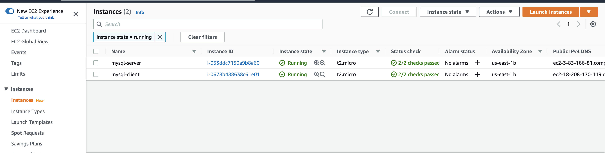
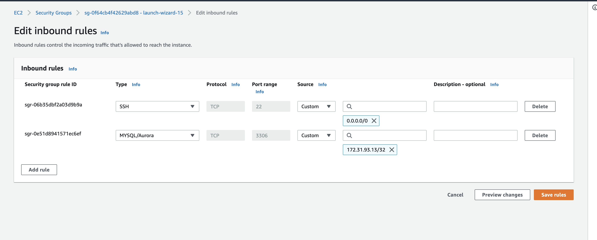

# CLIENT-SERVER ARCHITECTURE WITH MYSQL

### Project 5

#### setup instances for the mysql client and server



#### setup security group for mysql server

allow port 3306 and private ip of the client


#### install mysql-server in server instance

```bash
sudo apt update
sudo apt install mysql-server
sudo service mysql start
sudo mysql
```

```sql
mysql> DROP USER 'root'@'localhost';
mysql> CREATE USER 'root'@'%' IDENTIFIED BY 'password';
mysql> GRANT ALL PRIVILEGES ON *.* TO 'root'@'%' WITH GRANT OPTION;
mysql> FLUSH PRIVILEGES;
```

#### install mysql-client in the client instance

```bash
sudo apt update
sudo apt install mysql-client
```

#### connect to the mysql server using its private ip

